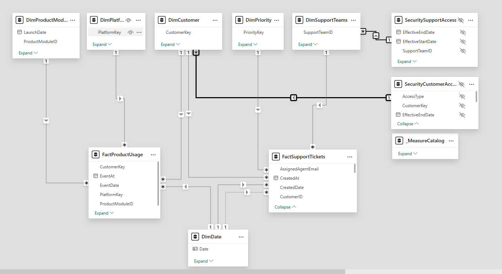
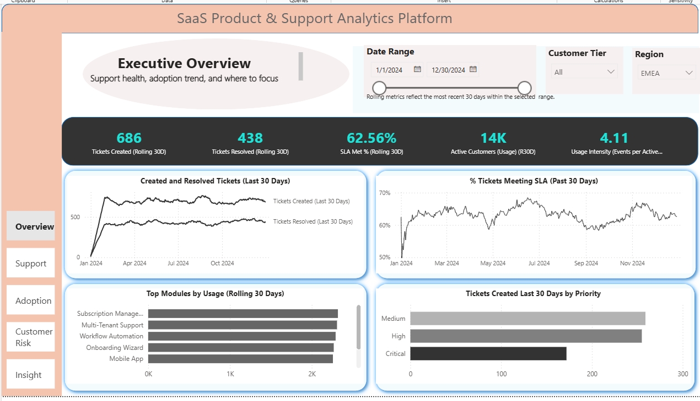
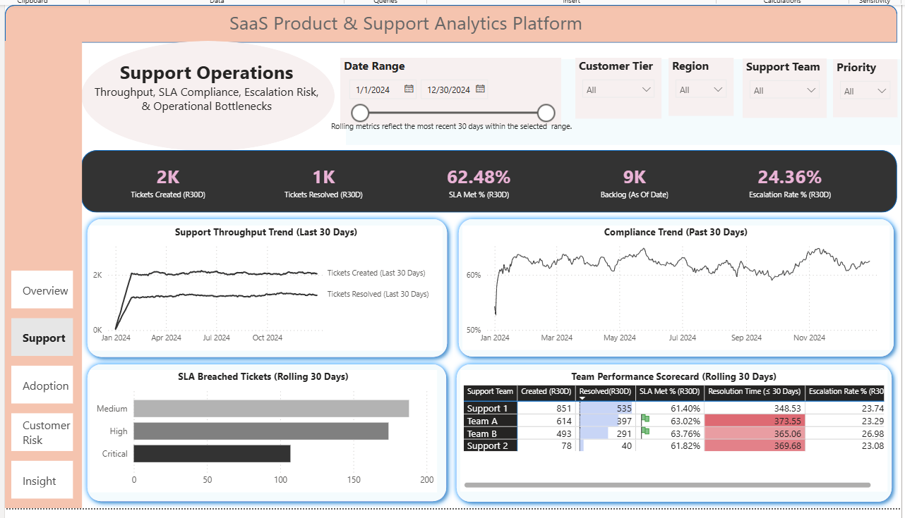
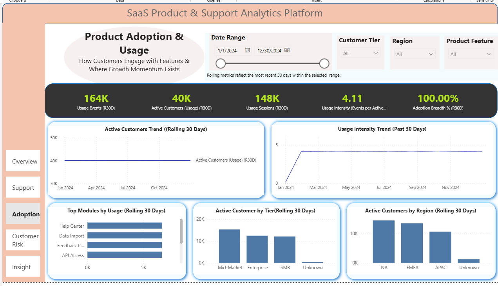
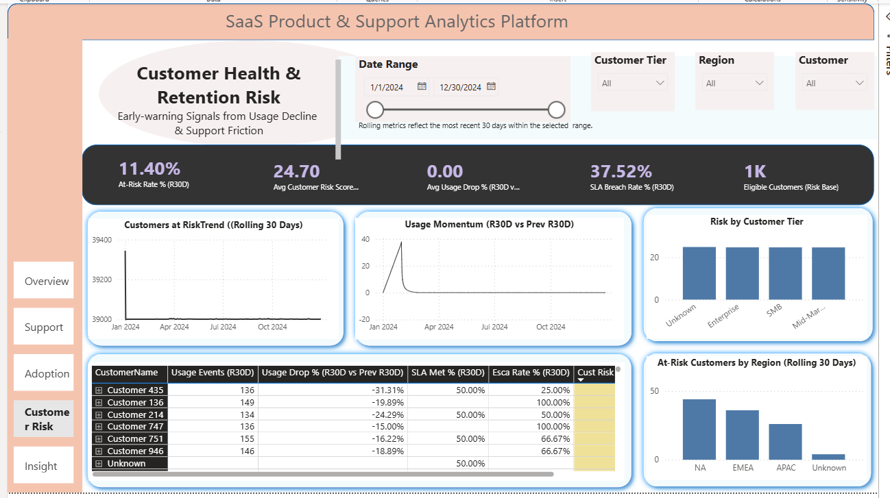
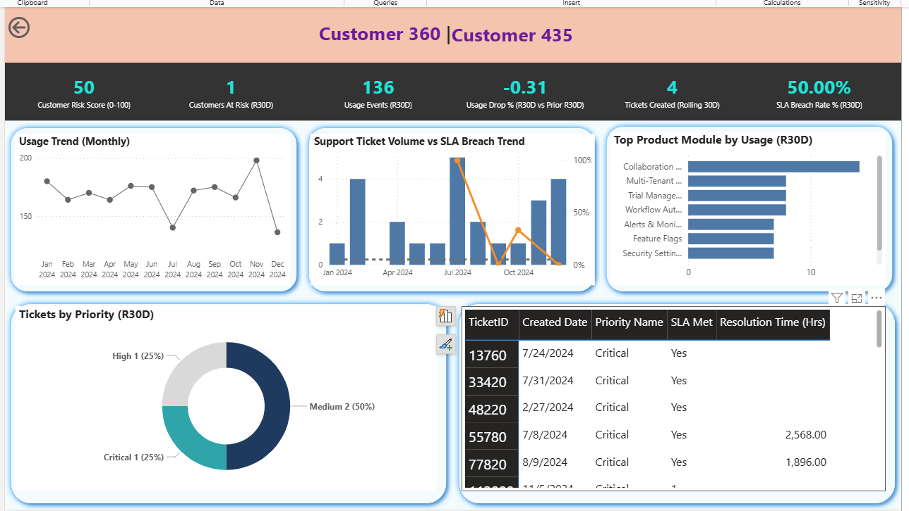
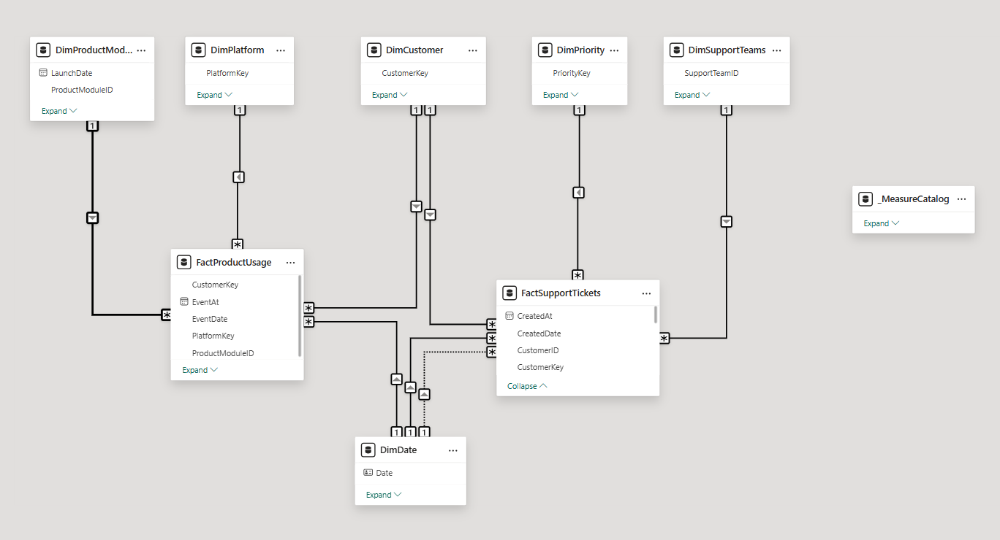

# SaaS Product & Support Analytics Platform (Power BI)

**NimbusSoft — Executive, Product, and Customer Risk Analytics**

---

## How to Review This Project (2-Minute Lens)

This repository is **not a dashboard gallery**.

It demonstrates how a senior analytics practitioner designs a **governed, production-style Power BI solution** that supports executive decision-making in a SaaS environment.

When reviewing, focus on:

* **Why** specific KPIs exist (not just what they show)
* How product usage, support operations, and customer risk are **connected**
* The **architecture, governance, security, and tradeoffs**, not visual polish alone

---

## 1. Project Overview

This project simulates a **production-grade SaaS analytics platform** for a fictional mid-market B2B company, **NimbusSoft**, and its core product **NimbusCore**. It is designed using **patterns, architectures, and governance approaches implemented in real SaaS organizations**, adapted here using synthetic data for portfolio demonstration.

The objective was **not** to build dashboards, but to design a **governed analytics system** that enables leadership to:

* Understand product adoption and usage momentum  
* Monitor support performance and SLA risk  
* Identify early customer disengagement and churn risk  
* Decide **where to intervene proactively**

Although the data is synthetic, the **modeling approach, DAX patterns, governance decisions, security architecture, and performance tradeoffs** mirror real-world SaaS analytics implementations.

---

## 2. Business Context & Stakeholders

**Primary stakeholders supported by this solution:**

* **VP of Product** — feature adoption, engagement trends  
* **Head of Customer Support** — SLA compliance, backlog risk  
* **Director of Customer Success** — customer health and retention risk  
* **Executive Leadership** — cross-functional intervention signals  

Each KPI and dashboard in this project traces back to **explicit stakeholder questions and decisions**, not generic reporting.

---

## 3. Solution Architecture (High Level)

### Data Sources

* Product usage events  
* Support ticket data  
  *(simulated to reflect realistic SaaS patterns)*  

---

### Semantic Model

* Clean **star schema**
* Two fact tables at different grains:
  * **Product Usage** (event grain)
  * **Support Tickets** (ticket grain)
* Conformed dimensions:
  * Date, Customer, Product Module, Priority, Support Team, Platform
* Single marked Date table with **role-playing dates** for ticket lifecycle analysis

---

### Analytics Layer

* Canonical KPI definitions
* Centralized measure catalog
* Defensive DAX patterns
* Rolling time intelligence and trend comparisons

---

### Dynamic Row-Level Security (RLS)

The semantic model includes enterprise-style **dynamic RLS** using governed bridge tables. Both customer-level (CSM) and team-level (SupportLead) access patterns are implemented and validated.

* `SecurityCustomerAccess` (customer-based access)
* `SecuritySupportAccess` (support-team-based access)

Security tables filter conformed dimensions using **single-direction relationships**, ensuring:

* Predictable filter propagation  
* No ambiguous many-to-many paths  
* No fact-level security hacks  
* Clean separation between analytical logic and access control  

This design simulates real SaaS access patterns, supporting:

* Customer Success Manager (CSM) customer-level access  
* Support Lead team-based access  

### Security Model Overview

See detailed documentation in:  
`/docs/security-model.md`

---

## 4. Key Analytics & KPIs

### Product & Adoption

* Active customers (rolling)
* Usage intensity (events per active customer)
* Adoption breadth across modules
* Usage trends and momentum

---

### Support Operations

* Ticket throughput and backlog
* SLA compliance and breach rate
* Escalation trends
* Team performance diagnostics

---

### Customer Health & Risk

* Customers at Risk (percentile-based low usage + usage decline)
* Composite Customer Risk Score (0–100)
* Early churn proxy indicators

These KPIs are designed to surface **signals**, not just historical counts.

---

## 5. Dashboards (What They Enable)

The solution includes five executive and operational views plus one governed drill-through page:

### 1. Executive Overview — rolling KPIs and trends  

### 2. Support Operations — SLA, backlog, throughput  

### 3. Product Adoption & Usage — engagement and feature usage  

### 4. Customer Health & Risk — early churn signals  

### 5. Executive Insights & Action Framework — diagnostic matrix for intervention  

### 6. Customer 360 Drill-through Page  
A dedicated contextual investigation page combining rolling usage metrics, SLA performance, support demand composition, and ticket-level detail.

This page is intentionally hidden from primary navigation and accessed only via drill-through to preserve executive clarity while enabling deep operational diagnostics.

Dashboards are intentionally **diagnostic and action-oriented**, not exploratory demos.

> Representative screenshots are provided in the `/images` folder for context only.

---

## 6. Performance, Governance & Security

* Dataset implemented as a **governed semantic model**
* Fact tables and technical keys hidden from report authors
* Canonical KPIs exposed through a curated measure catalog
* Deprecated logic archived rather than deleted
* Performance profiled using **Power Query Diagnostics** and **Performance Analyzer**
* Analytically expensive metrics (e.g., percentile-based risk) explicitly documented and justified
* Dynamic RLS implemented using dimension-level bridge tables
* Security tables hidden from report view and validated using role simulation

This approach supports **trusted self-service analytics** at scale while preserving enterprise-grade governance and access control.

---

### Semantic Model Overview

---

## 7. What This Project Demonstrates

* Business-first analytics design  
* Strong data modeling fundamentals  
* Advanced DAX with explainable tradeoffs  
* Dynamic Row-Level Security architecture  
* Governance and metric discipline  
* Executive-focused storytelling  
* Realistic SaaS analytics patterns  

---

## 8. Notes & Disclaimer

All data used in this project is **synthetic and fictional**, created solely for portfolio demonstration purposes.

However, the **analytics patterns, data modeling decisions, DAX techniques, governance structures, security architecture, and performance considerations** reflect approaches designed and implemented in real SaaS analytics environments.

NimbusSoft and NimbusCore are not real companies or products.

---

## 9. Repository Navigation

* `/images` — dashboard screenshots (context only)
* `/docs` — architecture, governance, security, and KPI documentation
* `/assets` — diagrams and supporting visuals
* `/pbix` — Power BI report files (available upon request or during interviews)

---

## Suggested Technical Reading Order (For Deep Reviewers)

For those evaluating the architecture and modeling depth:

1. `/docs/business-context.md`
2. `/docs/semantic-model.md`
3. `/docs/kpi-dictionary.md`
4. `/docs/security-model.md`
5. `/docs/governance.md`
6. `/docs/performance-notes.md`
7. `/docs/drillthrough-customer360.md`

This order mirrors the logical progression of the solution from business framing through modeling, analytics, security, and performance.
