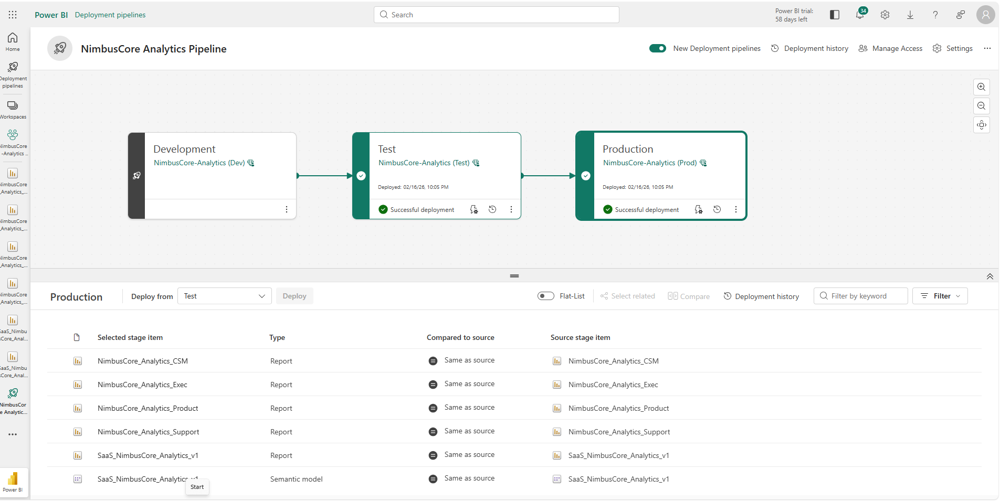
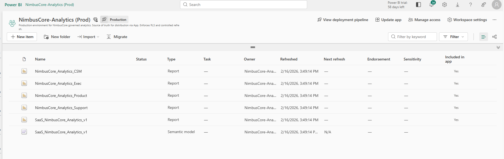
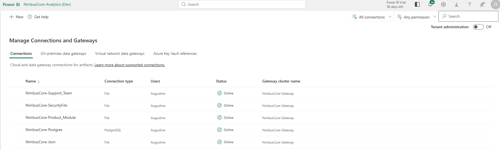
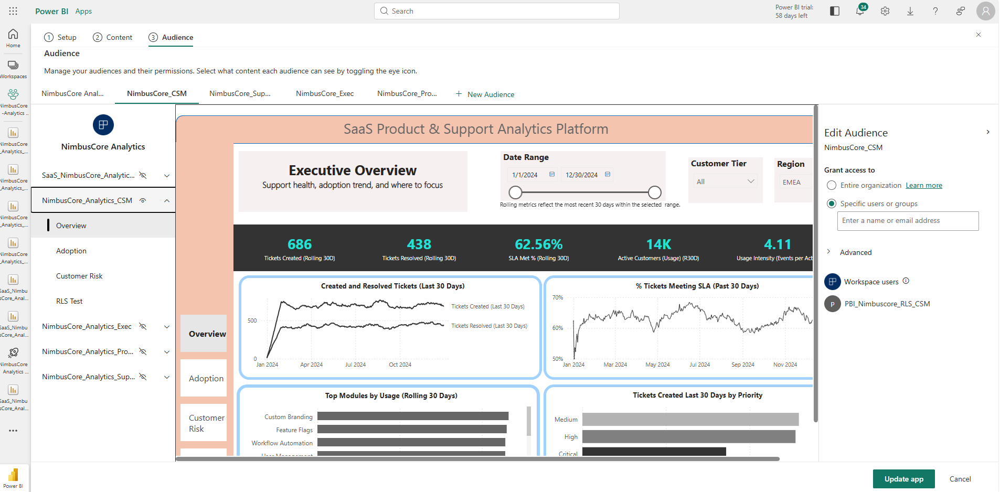
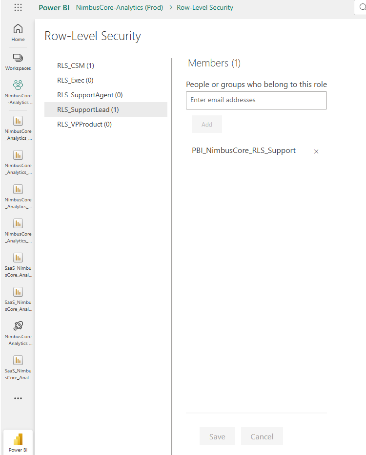
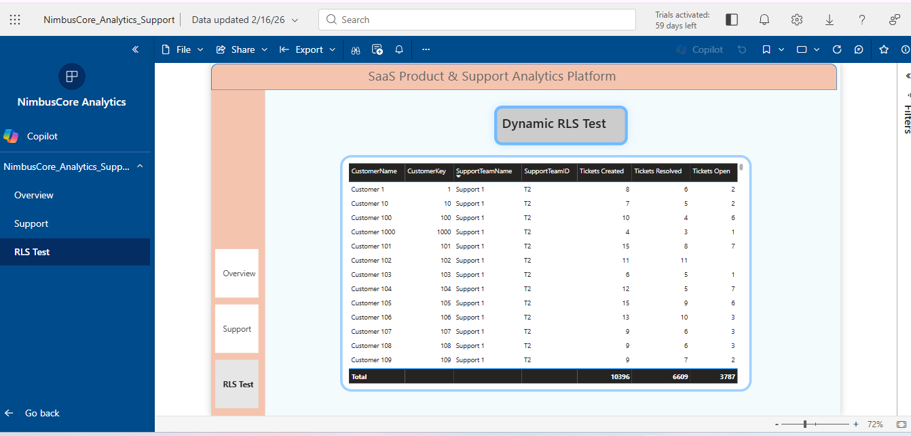

# Power BI Service Deployment – NimbusCore Analytics

This document outlines the enterprise-grade Power BI Service deployment architecture for the **NimbusCore SaaS Analytics Platform**.

The deployment follows Microsoft Fabric best practices for:

- Environment separation (Dev → Test → Prod)
- Controlled artifact promotion
- Secure gateway configuration
- App-based enterprise distribution
- Azure AD (Entra ID) group-driven Row-Level Security
- Production validation and refresh governance

---

# 1. Deployment Architecture Overview

NimbusCore Analytics is deployed using **Power BI Deployment Pipelines** to enforce structured environment promotion.

- Development (Authoring)
- Test (Validation)
- Production (Governed Distribution)

## Deployment Pipeline

This ensures:

- Controlled promotion
- Artifact comparison before deployment
- Clear separation of environments
- Auditability through deployment history

---

# 2. Production Workspace (Source of Truth)

The Production workspace contains:

- Semantic Model (single governed dataset)
- Audience-specific reports
- Controlled App distribution

## Production Workspace Contents

Governance principles applied:

- Only Admin has workspace-level control
- End users access content through App only
- Dataset build permissions restricted
- No direct semantic model exposure

---

# 3. Data Connectivity & Gateway Architecture

Production refresh relies on an On-Premises Data Gateway.

## Active Gateway Connections

Configured Connections:

- PostgreSQL (NimbusCore-Postgres)
- Security mapping file
- Support team file
- Product module file
- JSON ingestion source

Architecture Highlights:

- Encrypted credential storage
- Secure gateway cluster registration
- Refresh validation in Production
- Connection mapping per semantic model

---

# 4. App-Based Enterprise Distribution

Reports are distributed via a Power BI App — not through workspace access.

This is the enterprise-standard distribution method.

## 4.1 Audience Segmentation

Separate App Audiences were created:

- NimbusCore_CSM
- NimbusCore_Support
- NimbusCore_Exec
- NimbusCore_Product

Each audience:

- Sees only their relevant report
- Cannot access unrelated content
- Is assigned via Entra ID group

No duplication of datasets.
One semantic model powers all reports.

---

# 5. Security Architecture – Dynamic Row-Level Security (RLS)

Security is enforced at the semantic model layer using:

- Dynamic RLS logic
- Entra ID security groups
- Role-based mapping

## 5.1 Entra ID Group-Based Role Assignment

Roles configured:

- RLS_CSM
- RLS_SupportAgent
- RLS_SupportLead
- RLS_Exec
- RLS_VPProduct

Each role maps to a dedicated Entra ID group:

- PBI_NimbusCore_RLS_CSM
- PBI_NimbusCore_RLS_Support
- etc.

This ensures:

- Centralized identity governance
- No manual user-level assignment
- Scalable enterprise security model

---

# 6. RLS Validation & Proof of Enforcement

RLS enforcement was validated using service accounts.

## 6.1 Support Account Validation

Observed Behavior:

- Support account sees only assigned team customers
- Other customers hidden
- Measures correctly recalculated within filtered context
- No data leakage

This confirms:

- Filter propagation across relationships
- Bidirectional security enforcement
- Secure production configuration

---

# 7. Deployment Pipeline Validation

All artifacts in Production match Test stage.

- Reports: Same as source
- Semantic Model: Same as source
- No drift detected

Promotion flow validated:

Dev → Test → Prod  
Successful deployment confirmed.

---

# 8. Enterprise Architecture Summary

## Infrastructure

- Power BI Deployment Pipeline
- On-Premises Data Gateway
- Encrypted credential storage
- Secure refresh validation

## Governance

- Single semantic model
- App-based distribution
- No direct workspace exposure
- Controlled dataset permissions

## Security

- Entra ID group-driven RLS
- Dynamic DAX security logic
- Service account validation
- Production-tested enforcement

---

# 9. Production-Ready Capabilities Demonstrated

✔ Multi-environment deployment  
✔ Controlled artifact promotion  
✔ Gateway configuration and refresh validation  
✔ App-based enterprise distribution  
✔ Audience segmentation  
✔ Azure AD (Entra ID) group security  
✔ Dynamic Row-Level Security  
✔ Service-account validation testing  

---

# 10. Conclusion

NimbusCore Analytics demonstrates a fully governed, enterprise-grade Power BI Service deployment aligned with real-world SaaS BI architecture standards.

The solution enforces:

- Security at the semantic layer
- Distribution through Apps
- Identity-driven access control
- Controlled CI/CD-style promotion

This deployment reflects production-ready Microsoft Fabric best practices.
