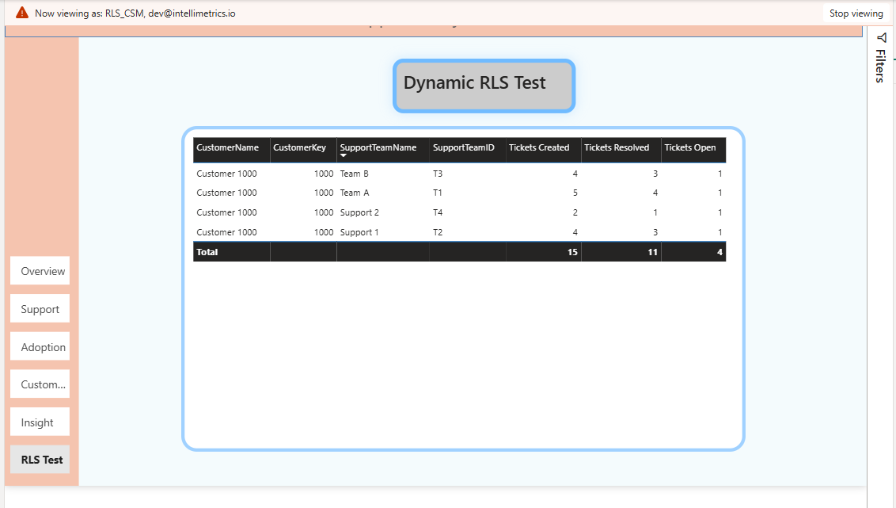
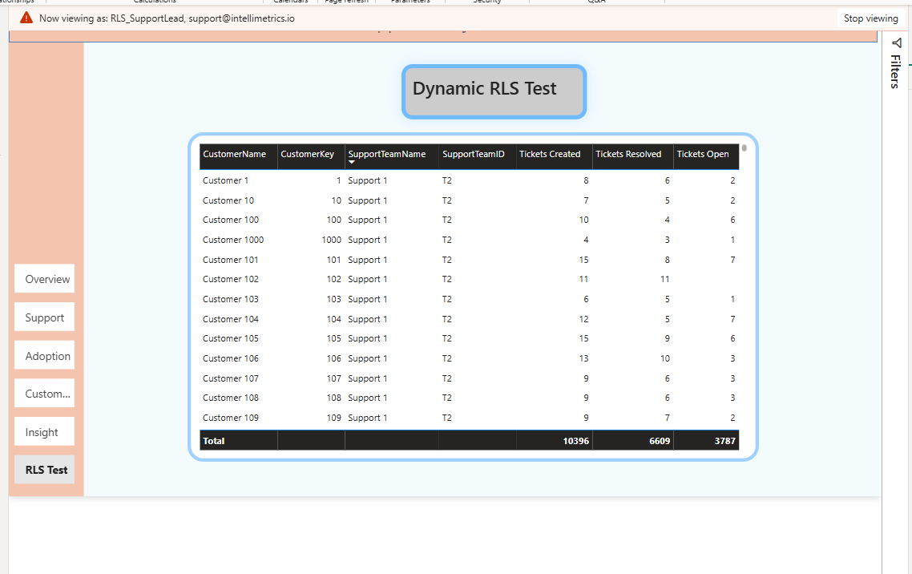

# Security Model (Dynamic RLS)

## Overview

This Power BI semantic model implements **dynamic Row-Level Security (RLS)** to simulate real enterprise access patterns in a SaaS analytics environment. Security is designed using dedicated **bridge access tables** that filter conformed dimensions, ensuring scalable governance, predictable filter propagation, and strong separation of analytical and security logic.

The model supports two primary access patterns:

- **Customer-based access (CSM)**: a user can view only assigned customers and all related usage and support activity for those customers.
- **Support-team access (SupportLead)**: a user can view only tickets for their assigned support team across all customers.

This mirrors real SaaS organizational structures and prevents unauthorized data exposure while preserving model clarity and performance.

---

## Model Evolution

The semantic model was originally built as a clean **star schema** supporting product usage and support analytics.

Dynamic RLS was later implemented by extending the model with dedicated security bridge tables:

- `SecurityCustomerAccess`
- `SecuritySupportAccess`

These tables filter conformed dimensions using **single-direction relationships**.

No changes were made to fact tables or DAX measure logic. Security was layered onto the dimension level, preserving analytical integrity while introducing governance controls. This reflects industry best practice: security should enhance the model architecture, not distort it.

---

## Security Tables

### 1) SecurityCustomerAccess (Customer-Based Access)

**Purpose:** Maps users to the customers they are authorized to view.

**Key columns:**
- `UserEmail` (mapped to `USERPRINCIPALNAME()` in Power BI Service)
- `CustomerKey`
- `AccessType` (e.g., CSM)
- `IsActive`
- `EffectiveStartDate`
- `EffectiveEndDate`

**Filter propagation path:**

User  
→ `SecurityCustomerAccess`  
→ `DimCustomer`  
→ Fact tables (`FactProductUsage`, `FactSupportTickets`)

**Expected behavior:**
- A CSM sees only assigned customers.
- All usage and support activity is automatically restricted to those customers.
- No unrelated customer data is visible.

---

### 2) SecuritySupportAccess (Support-Team-Based Access)

**Purpose:** Maps users to the support team(s) they are authorized to view.

**Key columns:**
- `UserEmail`
- `SupportTeamID`
- `AccessType` (e.g., SupportLead)
- `IsActive`
- `EffectiveStartDate`
- `EffectiveEndDate`

**Filter propagation path:**

User  
→ `SecuritySupportAccess`  
→ `DimSupportTeams`  
→ `FactSupportTickets`

**Expected behavior:**
- A SupportLead sees only tickets handled by their assigned support team.
- Multiple customers may be visible if served by that team.
- Other teams' tickets remain inaccessible.

---

## Relationship Design (Governed & Performant)

The security implementation follows enterprise modeling standards:

- Security tables filter dimension tables using **single-direction relationships**
- No bidirectional filtering is used for security propagation
- Security tables are **hidden from report view**
- No security logic is embedded in DAX measures
- No fact-to-security direct joins exist
- No many-to-many ambiguity is introduced

This design ensures:

- Predictable filter behavior
- Clean semantic modeling
- Strong separation of analytical logic and access control
- Stable performance in Power BI Service

---

## RLS Roles Implemented

### Role: `RLS_CSM`

Filters data based on `SecurityCustomerAccess`, using:

- `UserEmail = USERPRINCIPALNAME()`
- `IsActive = 1`
- Current date within `EffectiveStartDate` and `EffectiveEndDate`

**Behavior:**
- Restricts customer visibility to assigned accounts
- Automatically limits related support and usage metrics

---

### Role: `RLS_SupportLead`

Filters data based on `SecuritySupportAccess`, using:

- `UserEmail = USERPRINCIPALNAME()`
- `IsActive = 1`
- Current date within `EffectiveStartDate` and `EffectiveEndDate`

**Behavior:**
- Restricts support ticket visibility to assigned teams
- Allows cross-customer visibility within that team scope

---

## Validation & Testing

Security was validated using:

- Power BI Desktop "View as role"
- A dedicated in-report **Dynamic RLS Test** page
- Totals validation to confirm no aggregation leakage
- Cross-role testing (CSM vs SupportLead)

Validation confirmed:

- Customer-level filtering works independently
- Support-team filtering works independently
- No cross-filter leakage occurs
- Aggregations respect row-level restrictions
- Relationship direction remains single-direction and stable

---

## Governance Principles Applied

- Security logic resides at the semantic model level
- Access is driven by role identity, not hard-coded user filters
- Effective dating supports future reassignment scenarios
- Security tables are not exposed to report authors
- Analytical logic remains reusable and security-agnostic

This implementation reflects production-grade BI governance standards.

---

## Security Architecture Screenshots

### 1) Semantic Model with Security Bridges

This view shows the star schema extended with dedicated security bridge tables filtering dimensions using single-direction relationships.

---

### 2) RLS Validation – CSM Role

The CSM role restricts visibility to assigned customers while preserving full access to usage and support metrics within those accounts.

---

### 3) RLS Validation – SupportLead Role

The SupportLead role restricts visibility to tickets handled by the assigned support team across multiple customers.

